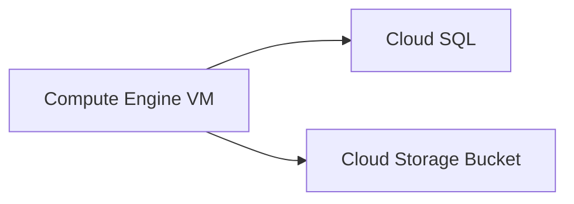

# Lab 01 – Compute & Storage

## 🎯 Objective
Deploy virtual machines, configure Cloud Storage, and integrate Cloud SQL to simulate real-world compute and storage scenarios.

---

## 🖥 Steps
1. **Compute Engine VM Deployment**
   - Create VM instance (Linux/Windows)
   - Configure machine type, zone, and network
   - Assign SSH keys or Windows credentials
   - Placeholder: Add screenshot of VM creation

2. **Cloud Storage Bucket**
   - Create bucket with appropriate region and storage class
   - Configure IAM permissions for secure access
   - Enable versioning and logging

3. **Cloud SQL Integration**
   - Create SQL instance (MySQL/PostgreSQL)
   - Configure authorized networks and users
   - Connect VM to SQL database for testing

---

## ✅ Achievements
- Successfully deployed scalable compute resources
- Configured secure cloud storage with access controls
- Practiced VM-to-database connectivity and testing

---

