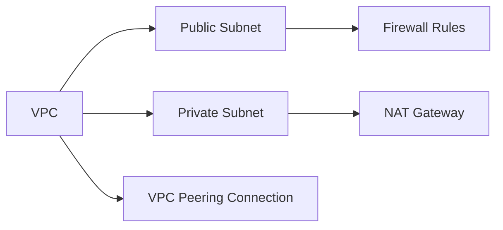

# Lab 02 – Networking

## 🎯 Objective
Design and implement secure VPCs, subnets, firewall rules, and network peering for hybrid cloud scenarios.

---

## 🖥 Steps
1. **VPC Creation**
   - Create VPC with custom subnets
   - Assign IP ranges and route tables

2. **Subnet Segmentation**
   - Separate public and private subnets
   - Configure NAT gateway for outbound access

3. **Firewall Rules**
   - Restrict inbound/outbound traffic based on service
   - Test connectivity between VMs and cloud resources

4. **VPC Peering**
   - Connect multiple VPCs for hybrid integration
   - Validate routing and communication

---

## ✅ Achievements
- Implemented secure, segmented network
- Applied principle of least privilege for traffic control
- Gained practical knowledge of hybrid cloud connectivity

---

