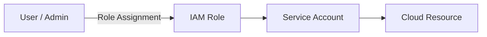

# Lab 03 – Identity & Access Management (IAM)

## 🎯 Objective
Configure secure access using IAM roles, service accounts, and role-based access control (RBAC).

---

## 🖥 Steps
1. **Service Account Creation**
   - Generate service accounts for automation and apps
   - Assign appropriate roles

2. **Custom IAM Roles**
   - Create roles with granular permissions
   - Apply roles to service accounts and users

3. **RBAC Implementation**
   - Enforce role-based access to resources
   - Test access control for different user roles

---

## ✅ Achievements
- Secured cloud resources via IAM and RBAC
- Gained experience in access management and policy enforcement
- Applied best practices for cloud identity security
---

