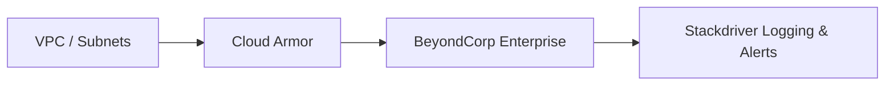

# Lab 04 – Security & Monitoring

## 🎯 Objective
Implement security hardening, monitoring, and automated alerting in cloud environments.

---

## 🖥 Steps
1. **VPC Security**
   - Configure firewall rules for allowed services
   - Implement private subnets for sensitive resources

2. **Cloud Armor & BCE**
   - Apply Cloud Armor policies for DDoS mitigation
   - Deploy BeyondCorp Enterprise (BCE) for zero-trust access

3. **Monitoring & Logging**
   - Enable Stackdriver logging & alerts
   - Integrate with SIEM or n8n automation workflows

---

## ✅ Achievements
- Hardened cloud infrastructure against attacks
- Configured real-time monitoring and alerting
- Applied zero-trust security principles

---

