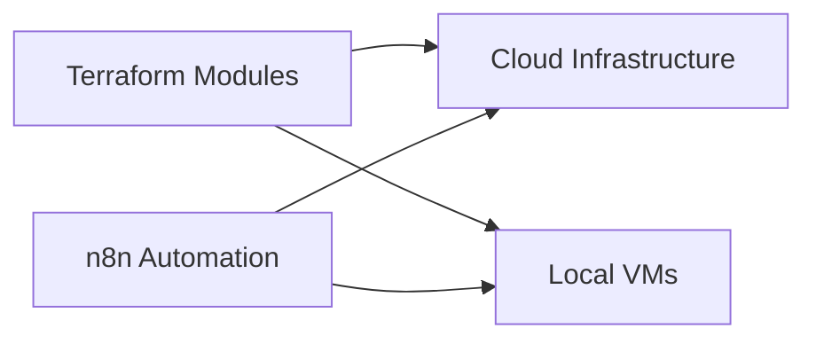

# Lab 05 – Automation & Infrastructure As A Code

## 🎯 Objective
Automate cloud deployment using Terraform and workflow tools for repeatable, secure infrastructure.

---

## 🖥 Steps
1. **Terraform Module Deployment**
   - Write IaC scripts for VM, network, and storage
   - Test module creation and variable management

2. **State Management**
   - Configure Terraform state storage
   - Use workspaces for multi-environment management

3. **Workflow Automation**
   - Integrate n8n for scheduled tasks and alerts
   - Automate resource provisioning and scaling

---

## ✅ Achievements
- Practiced end-to-end automation with Terraform
- Achieved repeatable, version-controlled cloud deployments
- Integrated workflow automation for efficiency and monitoring
---

