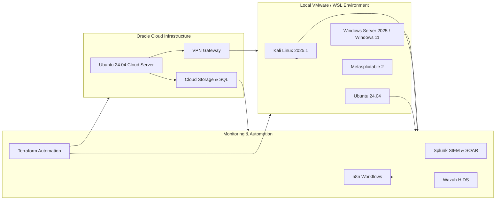

# ☁️ Cloud Security Labs

  
  
  

## 🎯 Overview
Hands-on labs for **Google Cloud Associate Cloud Engineer training**, focused on deploying, securing, and automating cloud infrastructure. Labs are structured for **practical experience** in real-world scenarios.

---

## 📂 Lab Modules & Links
Click on each lab to view detailed step-by-step guides:

| Lab | Description | Badge |
|-----|------------|-------|
| [01 – Compute & Storage](01_Compute_Storage.md) | VM deployment, Cloud Storage, Cloud SQL integration |  |
| [02 – Networking](02_Networking.md) | VPC, subnets, firewall rules, VPC peering |  |
| [03 – IAM & Access](03_IAM_Access.md) | Service accounts, RBAC, IAM policies |  |
| [04 – Security & Monitoring](04_Security_Monitoring.md) | Cloud Armor, BCE, logging & alerting |  |
| [05 – Automation](05_Automation.md) | Terraform, n8n workflows, IaC |  |
| [06 – Load Balancing & Scaling](06_Load_Balancing.md) | HTTP/Internal LB, autoscaling, Pub/Sub |  |

---

## 🏆 Key Achievements
- Earned **Google Cloud Associate Cloud Engineer** certification  
- Deployed **secure, scalable cloud infrastructure**  
- Automated workflows and infrastructure provisioning using **Terraform & n8n**  
- Applied **zero-trust principles and cloud security best practices**  
- Practiced hybrid cloud integration, monitoring, and resilience testing

---

---

> This repository serves as a **hands-on portfolio** demonstrating real-world cloud deployment, automation, and security skills.
